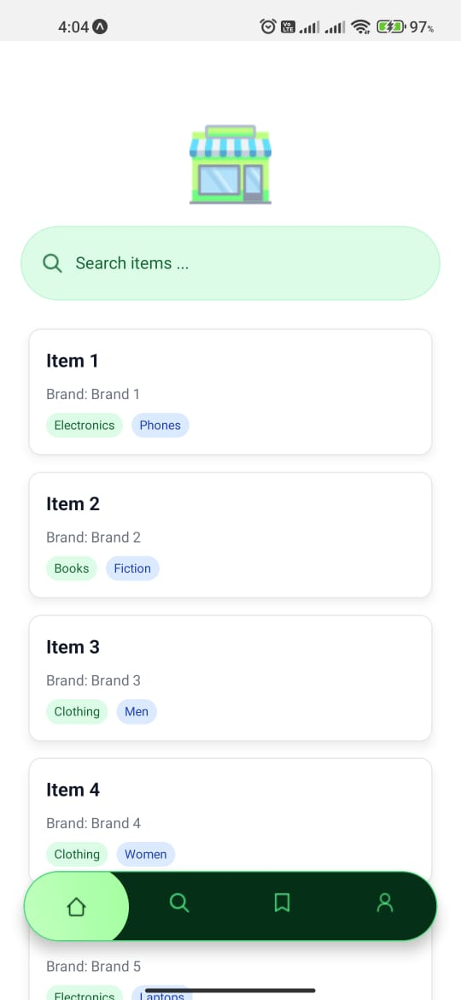
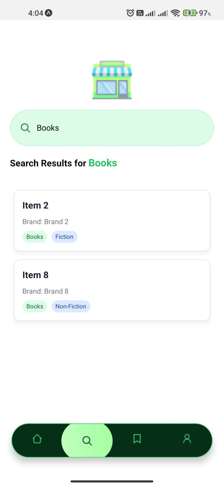

# Store Service Application (React Native)

## 📌 Introduction  
The application integrates with the provided **Store Service API**, retrieves store items, and allows users to browse and search/filter them through a clean and simple mobile UI.

* API repo
```sh
https://github.com/vish-mv/store-service
```
---

## 🎯 Objectives
- Fetch and display a list of items from the Store Service API (`/items` endpoint).
- Provide a **search/filter feature** to find items by category, subcategory, or name.
- Ensure proper **error handling** for network failures and empty states.
- Deliver a clean, minimal, and user-friendly **UI/UX**.

---

## 🛠️ Tech Stack
- **React Native (Expo)**
- **React Navigation** for routing
- **NativeWind (Tailwind for RN)** for styling
- **Axios / Fetch** for API requests

---

## 🏛️ Architecture
I followed a **modular component-based architecture**:
- **Screens**: `HomeScreen` (item list + search)
- **Components**: `ItemCard`, `SearchBar`
- **Services**: API functions (`/items`, `/items/filter`)
- **Hooks**: Custom hook `useFetch` for API calls and state management

This approach ensures:
- 🔹 **Separation of concerns** (UI, API, and logic are decoupled)  
- 🔹 **Scalability** (easy to extend with more screens/features)  
- 🔹 **Maintainability** (clear folder structure, reusable components)  

---

## 🎨 UI/UX Design Choices
- **Simple card-based layout** for items (showing name, brand, category).
- **Search bar** at the top for quick filtering.
- **FlatList with pull-to-refresh** for smooth browsing.
- **Error & empty states** with descriptive messages.

The goal was to keep the interface **minimal, intuitive, and mobile-friendly**.

---

## 🚀 Features
- ✅ Fetch items from API
- ✅ Display item list with brand & category
- ✅ Search items by keyword / category
- ✅ Error handling for failed API calls
- ✅ Loading indicators

---

## ⚠️ Known Issues / Improvements
- Pagination not yet implemented (currently fetches all items at once).
- UI design can be enhanced with images and animations.
- State management is handled via hooks only (no external state management library).

---

## 🤖 AI Tool Declaration
- **ChatGPT**: Used to generate boilerplate code for API service, refactor components, and draft this README.
- **GitHub Copilot**: Assisted in generating repetitive JSX structures.

---

## 📷 Screenshots



---

## ▶️ Running the Project
1. Clone the repo:
   ```bash
   https://github.com/RashmithaDeSilva/Store_Service.git
   cd Store_Service
   npm i
   npm run start
   ```
